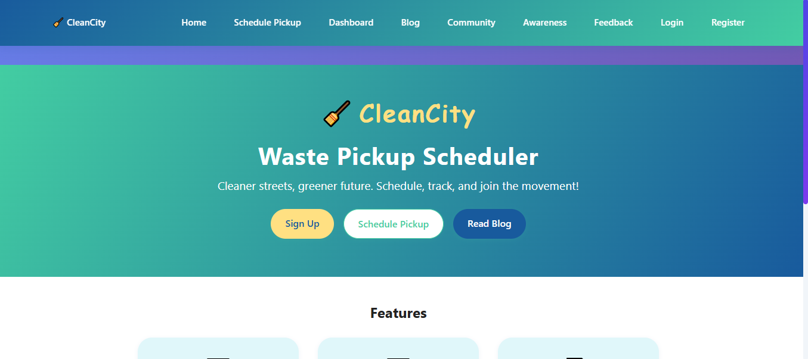

# CleanCity: Waste Pickup Scheduler - Test Report

---

## 📋 **Document Information**

**Course:** Software Testing & Quality Assurance  
**Project Type:** Group Assessment  
**Team Name:** KNS  
**Submission Date:** 2025-11-05
**Prepared by:** Sally Trizer 

## Team Information

| Role | Name | Responsibilities |
|------|------|------------------|
| Test Manager | Keamogetswe M| Planning, scheduling, coordination, metric tracking |
| Test Executor | Sally Trizer Keamogetswe M | Execution, evidence capture, defect logging |
| Risk Analyst | Sally Trizer | Risk identification, prioritization, test design linkage |

## 1. Executive Summary
CleanCity is a web-based platform designed to streamline waste pickup scheduling for residents and this report will present the results of a comprehensive testing done by members of the KNS as part of the final project for the PowerLearn Project Software Testing & Quality Assurance course. Testing took place from 30 October 2025 to 18 November 2025, where manual and automated testing was used test the functionality, performance, usability, accessibility and security across the web application.

### 1.1 Key Finding:
- Core Functional Issues:
  - Authentication: System allows login with unregistered or invalid credentials.

### 1.2 Recommandation:
- We have identified major issues that affect the core functionalities of the app, therefore, we as KNA QA team we **Recommend** that the app should not be **RELEASED** until issues have been solved. 

## 2. Objectives
As the KNS software testing team, our primary objective is to ensure that the CleanCity system meets all functional and non-functional requirements, functions reliably and is secure. Specifically, we aim to:

- Verify that all functional and non-functional requirements are met.
- Identify and document software defects with reproducible evidence.
- Ensure risk-based testing coverage of critical modules.
- Validate the system’s security, usability and compatibility across devices.
- Ensure the CleanCity application is fully ready for deployment.  

## 2. Overview of the CleanCity System

CleanCity is a web-based platform designed to streamline and modernize waste management operations for residents, waste collectors, and administrators. The system allows users to report waste issues, request collection services, track the status of their submissions, and communicate directly with the management team. Administrators can monitor reports, assign tasks, update progress, and analyze waste trends. The platform aims to improve city cleanliness, enhance reporting accuracy, reduce response time, and promote transparency and accountability in urban waste management. 

## 3. Scope of Testing
The scope of testing for the CleanCity Waste Pickup Scheduler focused on ensuring that the system meets all functional and non-functional requirements.

### 3.1 Functional Testing
Functional testing covered the following areas:

- **Authentication System**
  - User registration, login, logout and role-based access controls.
- **Waste Management**
  - Scheduling and managing waste pickups, tracking request status and notifications.
- **Dashboard & Analytics**
  - Displaying user-specific dashboards, generating analytics and reports, and tracking  achievements.
- **Content Management**
  - Managing blog posts, community feeds and interactive eco-tips.
- **Community Features**
  - Managing user profiles, social interactions and community interaction.
- **Administrative Functions**
  - Viewing and managing user accounts, approving or modifying requests, and moderating content.
- **Notification System**
  - Displaying and managing system notifications and alerts.
- **User Interface**
  - Ensuring responsive design, accessibility compliance, intuitive navigation and proper form validation.
- **Data Management**
  - Storing and retrieving user data.
- **Performance**
  - Monitoring response times and ensuring browser compatibility.
- **Error Handling**
  - Displaying user-friendly error messages and preventing invalid form submissions.

---

### 3.2 Non-Functional Testing
Non-functional testing focused on the following:
- **Performance**
  - Assessing page load times, responsiveness and behaviour under different network conditions.
- **Usability**
  - Evaluating overall user experience, accessibility and navigation.
- **Security**
  - Validating authentication, role-based access and input validation to protect against vulnerabilities.
- **Compatibility**
  - Ensuring the system works correctly across multiple devices, screen sizes and supported browsers.
- **Accessibility**
  - Confirming compliance with accessibility standards, keyboard navigation and screen reader support.

---

### 3.3 Areas Not Covered
The following areas were not included in the testing scope:
- **Data Management**
  - Sanitisation of user-generated content.
- **Performance / Compatibility**
  - Testing on Safari browser.
- **Support and Maintenance**
  - User activity logging and error reporting.
    
## 4 Test Strategy and Approach

### 4.1 Test Planning
- Review project requirements, user stories, and system workflows.
- Identify testing scope, objectives, and constraints.
- Define test strategy (functional, non-functional, UI, accessibility, performance, compatibility).
- Determine required resources: testers, tools, environments, and test data.
- Estimate timelines and create the test schedule.
- Identify risks and plan mitigation strategies.
- Prepare the Test Plan document for approval.

### 4.2 Test Design
- Create detailed test scenarios for all modules.
- Develop manual test cases with preconditions, steps, and expected results.
- Map test cases to requirements (RTM) for traceability.
- Identify test data needed for both valid and invalid inputs.
- Review and refine test cases to ensure coverage and accuracy.

### 4.3 Test Environment Setup
- Configure the frontend (web application interface).
- Configure backend services and APIs.
- Load necessary test data.
- Prepare test tools such as GitHub Issues and Browser DevTools.
- Verify that the test environment is stable and accessible.
- Conduct a smoke test to confirm readiness.

### 4.4 Test Execution
- Execute test cases step-by-step and record actual results.
- Validate functional behavior: registration, login, and pickup scheduling.
- Perform non-functional tests: usability, accessibility, performance, and security checks.
- Execute cross-browser and mobile responsiveness tests.
- Log all defects discovered into GitHub with severity and risk levels.
- Track defect progress and communicate with the development team.

### 4.5 Defect Management
- Identify and document defects with clear descriptions and reproduction steps.
- Assign severity levels (Critical, Major, Minor, Cosmetic).
- Link defects to specific test cases and risk IDs.
- Retest resolved defects to confirm fixes.
- Conduct regression testing after each development update.
- Update defect status (Open, In Progress, Resolved, Closed) in GitHub.

### 4.6 Test Reporting
- Summarize test execution results, coverage, and defect trends.
- Provide defect summary reports showing severity, category, and progress.
- Highlight risks, blockers, and unresolved issues.
- Provide recommendations for system stability and user experience improvements.
- Prepare the final Test Summary Report for project stakeholders.

## 5. Test Environment

- **Frontend:** CleanCity Web Application (*React App*)
- **Browsers Tested:** Chrome, Firefox, Edge
- **Devices Tested:** Windows desktop and Android smartphone
- **Test Data:** Relevant test data were created to cover a wide range of test scenarios, including valid, invalid and boundary inputs.
- **Tools Used:**  
    - **GitHub:** For defect tracking and issue management.  
    - **GitHub Projects:** For organising and managing test cases and test progress.  
    - **Browser Developer Tools:** For performance testing, network simulation, and debugging.  
    - **Selenium:** For executing automated test scripts across supported browsers.  
    - **NVDA (NonVisual Desktop Access):** For accessibility testing and ensuring compatibility with screen readers.

---

## 6 Test Execution Summary

### Planned Test Cases

| Category | Manual | Automated | Total |
|----------|--------|-----------|-------|
| Registration | 5 | 5 | 10 |
| Login | 5 | 5 | 10 |
| Logout | 3 | 1 | 4 |
| Role-Based Access | 4 | – | 4 |
| Pickup Scheduling | 7 | 1 | 8 |
| Request Management | 8 | – | 8 |
| Tracking | 3 | – | 3 |
| Dashboard | 3 | – | 3 |
| Blog System | 7 | – | 7 |
| Awareness | 5 | – | 5 |
| Community Feed | 3 | – | 3 |
| Community Features | 4 | – | 4 |
| Admin Functions | 4 | – | 4 |
| Session Management | 5 | – | 5 |
| Non-Functional | 20+ | – | 20+ |
| Boundary / Edge Cases | 10+ | – | 10+ |

### Executed Test Cases – Pass / Fail

| Category | Total | Pass ✅ | Fail ❌ | Defects Linked |
|----------|-------|---------|---------|----------------|
| User Registration | 10 | 10 | 0 | — |
| User Login | 10 | 6 | 4 | D-002, D-003 |
| User Logout | 4 | 2 | 2 | D-004 |
| Role-Based Access | 4 | 4 | 0 | — |
| Pickup Scheduling | 8 | 3 | 5 | D-005, D-006, D-007 |
| Request Management | 8 | 0 | 8 | D-000 |
| Request Tracking | 3 | 1 | 2 | — |
| Dashboard & Analytics | 3 | 0 | 3 | D-000 |
| Blog System | 7 | 4 | 3 | D-000 |
| Awareness Section | 5 | 5 | 0 | — |
| Community Feed | 3 | 3 | 0 | — |
| Community Features | 3 | 1 | 2 | D-001, D-002 |
| Administrative Functions | 12 | 0 | 0 | Pending |
| Notification System | 4 | 0 | 0 | Pending |
| Data Management | 5 | 5 | 0 | — |
| Support & Maintenance | 3 | 0 | 0 | Pending |
| UI / Responsiveness | 4 | 1 | 1 | D-008, D-009, D-010, D-011 |
| Navigation | 4 | 2 | 2 | — |
| Performance | 4 | 0 | 0 | Pending |
| Cross-Browser | 8 | 8 | 0 | — |
| Error Handling | 10 | 0 | 0 | Pending |
| Form Validation | 3 | 0 | 0 | Pending |
| Boundary / Edge Cases | 2+ | 0 | 0 | Pending |

---
## 6 b. sample test cases 

## 7. Defect Summary

### Functional Test Defects

| ID | Issue Title | Severity | Risk ID | Status | GitHub Link | Test Case ID |
|----|------------|---------|---------|--------|------------|-------------|
| D-001 | Profile shows email instead of full name | Cosmetic | R00 | Open | [Issue #28](#) | TC-001 |
| D-002 | Existing user can login with a completely invalid password | Critical | R001 | Open | [Issue #31](#) | TC-005 |
| D-003 | System allows login with unregistered credentials | Critical | R001 | Open | [Issue #32](#) | TC-006 |
| D-004 | Pick-up request submitted without user registration | Major | R001 | Open | [Issue #33](#) | TC-010 |
| D-005 | The pickup is scheduled even with invalid date | Medium | R003 | Open | [Issue #34](#) | TC-025 |
| D-006 | Pickup request allows instructions exceeding 200 characters | Medium | R003 | Open | [Issue #41](#) | TC-028 |
| D-007 | Scheduling multiple pickups for the same date | Medium | R003 | Open | [Issue #42](#) | TC-029 |

### Non-Functional Test Defects

| ID | Issue Title | Severity | Risk ID | Status | GitHub Link |
|----|------------|---------|---------|--------|------------|
| D-008 | Menu bar expands excessively when resizing window | Medium | R008 | Open | [Issue #55](#) |
| D-009 | Low contrast text fails WCAG 2.1 AA | Major | R008 | Open | [Issue #56](#) |

### Accessibility Test Defects

| ID | Issue Title | Severity | Risk ID | Status | GitHub Link |
|----|------------|---------|---------|--------|------------|
| D-010 | [Add title] | Major | R006 | Open / In Progress / Resolved / Closed | [Link](#) |
| D-011 | [Add title] | Major | R007 | Open / In Progress / Resolved / Closed | [Link](#) |

### Cross-Browser Compatibility Test Defects

| ID | Issue Title | Severity | Risk ID | Status | GitHub Link |
|----|------------|---------|---------|--------|------------|
| D-012 | [Add title] | Minor | R008 | Open / In Progress / Resolved / Closed | [Link](#) |
| D-013 | [Add title] | Major | R009 | Open / In Progress / Resolved / Closed | [Link](#) |

---

## 7b. Defect Summary by Category

Functional testing identified 7 defects, including 2 critical, 1 major, 3 medium, and 1 cosmetic. Non-functional testing revealed 2 defects, 1 major and 1 medium. Accessibility testing included 2 major defects, while cross-browser compatibility testing identified 2 defects (1 major, 1 minor). In total, 13 defects were reported. Most critical defects relate to login and authentication issues, while medium defects primarily involve scheduling and input validations. Non-functional and accessibility defects require UI and compliance fixes. Continuous monitoring is recommended for pending and in-progress defects to ensure timely resolution.

## 8. some of the issues  raised

# 9. Overall status
## Overall Summary

## Testing Summary
The CleanCity system underwent extensive testing across all major modules, with over 120 planned test cases executed. Testing covered functional areas such as registration, login, pickup scheduling, dashboard management, and community features. Several critical and major defects were discovered, especially in authentication, request management, and scheduling functionality. Non-functional testing also revealed issues in UI responsiveness and accessibility. Overall, testing provided strong coverage of system behavior and usability across different browsers and devices.

## Quality Assessment
The overall quality of the system is improving, but it is not yet ready for deployment. Critical defects affecting login security, data validation, and request workflows reduce the stability and reliability of the application. Medium-level issues also impact user experience, particularly in scheduling and interface handling. While core workflows function conceptually, further refinement and bug resolution are required. The structure of the system shows strong potential once major issues are addressed.

## Risk Assessment
- Authentication vulnerabilities that allow invalid or unregistered users to log in.
- Acceptance of invalid data, including pickup dates and oversized input fields.
- Missing or incomplete validation across critical workflows.
- UI inconsistencies across devices and screen sizes.
- Accessibility issues such as low contrast text and unresponsive navigation.
- Potential performance issues under increased system load.
- Incomplete backend features causing test blocks and pending cases.
- Risk of incorrect or delayed waste pickup due to flawed request management logic.

## Release Recommendation
Based on current results, the system **SHOULD NOT BE RELEASED** in its current state. Critical and major defects must be resolved and retested before deployment. Key priorities for developers include fixing login validation, improving request handling logic, refining UI responsiveness, and completing missing backend functionalities. A full regression testing cycle will be required once fixes are implemented. Only after these actions can the system be considered ready for a reliable and stable release.

## Testing Challenges
- Unstable test environment leading to inconsistent test results.
- Some system modules were still under development, causing incomplete or pending test cases.
- Delayed bug fixes slowed down regression testing cycles.
- Limited access to certain admin functionalities during the testing period.
- UI responsiveness varied across devices, requiring repeated cross-device checks.
- Difficulty reproducing certain defects due to intermittent system behavior.
- Lack of complete API documentation, making backend validation slower.
- Time constraints impacting the depth of non-functional and edge-case testing.

## how to acces the data 
on the repository link click on the test file - then on the Doc data.....you will have access to all impoertant documents on the software testing

# Approvals

The following stakeholders have reviewed the CleanCity Software Testing Report and approve its contents, findings, and recommendations. Their signatures confirm that the testing process has been completed to the agreed standards and that all documented results are accurate.

## Approved By

### Test Manager
**Name:** Keamogetswe  
**Signature:** _______________KM___________  
**Date:** ____18th november___________________________

### Tester
**Name:** Sally Trizer  and keamogetswe 
**Signature:** ___sato_______________________  
**Date:** ____18th november________KM___________________

### Risk Analyst
**Name:** Sally Trizer  
**Signature:** ___sato_______________________  
**Date:** __18th november_____________________________

end of test report 
sally trizer
